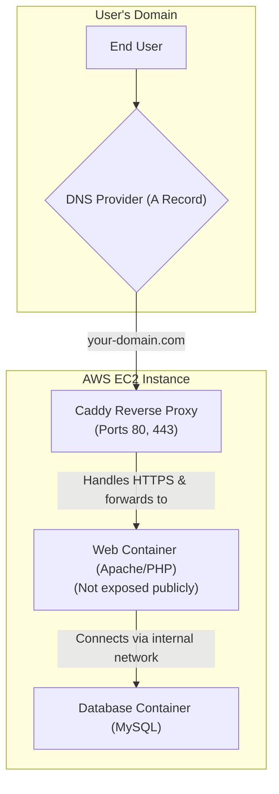

# Project Deployment & Architecture Guide

This guide documents the setup, architecture, and deployment process for the Dockerized Project & Workload Tracker application.

## 1. Project Overview

This is a two-page web application for tracking project workloads.
- **Page 1 (`index.html`):** A form to submit new project entries.
- **Page 2 (`dashboard.html`):** A dashboard with charts visualizing the submitted data.

The entire application is containerized using Docker and Docker Compose for consistent and portable development and production environments.

## 2. Technology Stack

- **Backend:** PHP 8.2
- **Web Server:** Apache (inside Docker)
- **Database:** MySQL 8.0
- **Frontend:** HTML, CSS, JavaScript
- **Libraries:** Bootstrap 5 (Styling), Chart.js (Data Visualization)
- **Containerization:** Docker & Docker Compose
- **Production Reverse Proxy:** Caddy (for automatic HTTPS)

## 3. Local Development Setup

The local environment is defined in `docker-compose.yml` and uses an environment file for credentials.

**Prerequisites:**
- Docker Desktop installed.

**Running the Local Environment:**

1.  **Create Environment File:** Create a file named `.env.local` in the project root.
    ```
    MYSQL_ROOT_PASSWORD=lamp_root_password
    MYSQL_DATABASE=lamp_db
    MYSQL_USER=lamp_user
    MYSQL_PASSWORD=lamp_password
    ```

2.  **Launch Services:** Run the following command from the project root:
    ```bash
    docker compose --env-file .env.local up -d --build
    ```

3.  **Accessing Services:**
    - **Web Application:** `http://localhost:8080`
    - **PhpMyAdmin:** `http://localhost:8081` (Login with user `root` and password `lamp_root_password`)

## 4. Production Architecture (AWS)

The application is deployed to an **Amazon EC2 instance** (Ubuntu 22.04 LTS).



- **Caddy** acts as the public-facing entry point. It automatically provisions and renews a free SSL certificate from Let's Encrypt and provides HTTPS for the domain. It then forwards traffic to the `web` container.
- The `web` container runs Apache and PHP. Its ports are not exposed to the public internet; it only accepts traffic from the Caddy container.
- The `db` container runs MySQL and is only accessible from within the internal Docker network.

## 5. Production Deployment Steps

These steps are performed on the provisioned AWS EC2 server.

1.  **Prerequisites:**
    - Git, Docker, and Docker Compose are installed on the server.
    - The server's SSH key has been added as a "Deploy Key" to the GitHub repository for read-only access.

2.  **Clone the Repository:**
    ```bash
    git clone git@github.com:fengmzhu/dv_website.git
    cd dv_website
    ```

3.  **Create Production Secrets File:**
    Create a file named `.env.prod`. This file is **never** committed to Git.
    ```bash
    nano .env.prod
    ```
    Add strong, unique passwords:
    ```
    MYSQL_ROOT_PASSWORD=a_very_strong_production_root_password
    MYSQL_DATABASE=lamp_db
    MYSQL_USER=lamp_user
    MYSQL_PASSWORD=a_very_strong_production_password
    ```

4.  **Create Production Compose & Caddy Files:**
    - `docker-compose.prod.yml`: This file adds the Caddy service.
    - `Caddyfile`: This file configures Caddy. Its content should be:
      ```
      your-domain.com {
          reverse_proxy web:80
      }
      ```
      (Replace `your-domain.com` with the actual domain).

5.  **Launch the Application:**
    This command combines the base and production compose files, loads the production secrets, and starts all services.
    ```bash
    docker compose -f docker-compose.yml -f docker-compose.prod.yml --env-file .env.prod up -d --build
    ```

## 6. Managing the Production Application

- **To see logs for a service:**
  `docker logs lamp_caddy` or `docker logs lamp_web`
- **To stop all services:**
  `docker compose -f docker-compose.yml -f docker-compose.prod.yml down`
- **To update the application after pushing new code to Git:**
  ```bash
  git pull origin master
  docker compose -f docker-compose.yml -f docker-compose.prod.yml --env-file .env.prod up -d --build
  ``` 